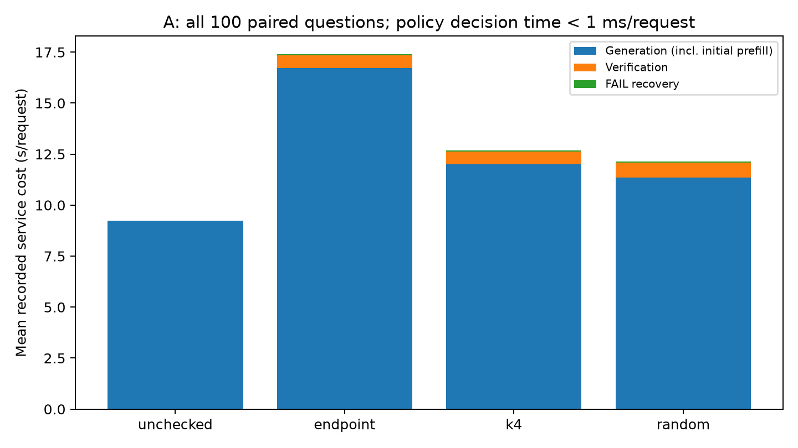
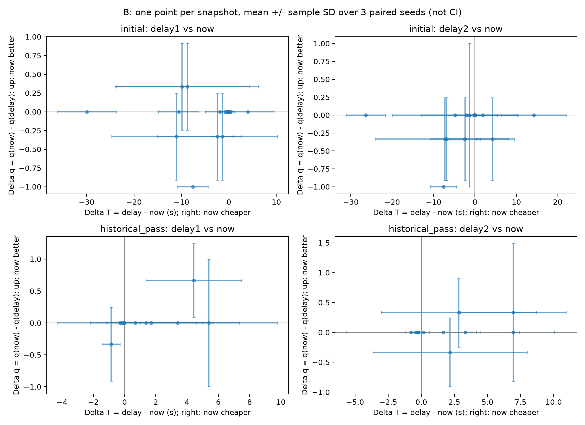
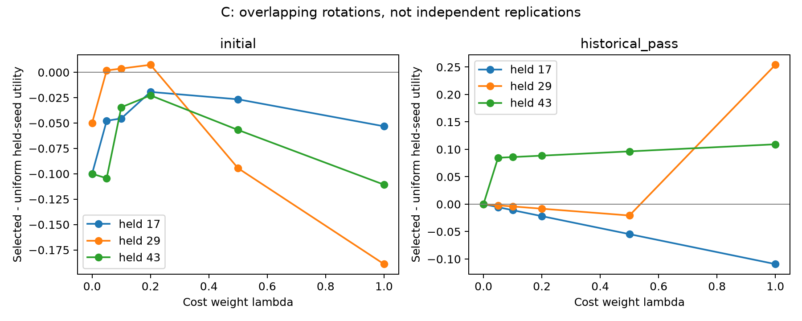

# 实验四进一步分析（已有数据，2026-09-27）

本报告由同目录 `analyze.py` 从原始状态、事件和冻结配置生成；图、表、CSV 均来自实际运行。原数据与原报告保留。

## 先读这一页

**① 当前最可靠的发现。** 四 A 的 400 条路径完全复现：unchecked、endpoint、k4、random 分别答对 49、65、62、60/100，平均服务成本分别为 9.23、17.41、12.68、12.13 秒。k4 比 endpoint 少 4.728 秒，几乎全部来自生成计时；生成量少 79.51 token/题，但回滚次数为 121 对 116，不是更少回滚。四 B 的三种子配对均值显示状态组有不同方向：初始组 delay1 比 now 便宜 4.025 秒，历史组 now 比 delay1 便宜 1.296 秒。这是固定历史下的后续净效果，质量差仍须同时看。

**② 原结论需要收窄。** 不能把服务秒数下降解释为质量匹配后的收益或含排队完成时间的下降。旧基线与新策略的每 token 实测时间也不同，设备状态和执行负载尚未排除。历史组原评价种子 43 的正向效用未跨种子稳定保留：评价 17 时所有正 λ 为负；评价 29 时只有 λ=1 为正。原轮次多答对的一题是 test-210；删除它仍有极小的计时收益，不能概括成所有收益都由它构成。状态差异足以支持小规模补采样，但不足以确认可学习、可部署的自适应收益，更不是可靠上界。

**③ 下一步最值得做的一项实验。** 固定现有 32 个快照、4 个动作，预登记 3 个新的配对种子，共 **384 条新增后续路径**。冻结原 17/29 选出的逐快照动作和组内统一参考，评价全部六个 λ，同时保留 now/delay1/delay2 的 ΔT、Δq。到 384 条即停止，不为追求正结果加种子；把“所有预定正 λ 在三个新种子上方向均为正、汇总质量差不负、逐题删除后方向仍正”作为进入独立题集研究的严格筛选条件（不是总体质量非劣证明）。若不满足，保留不稳定结论，暂不训练探针。本轮没有执行这些路径。

## 来源、配置和复现核对

数据位置为 `stages/stage1/runs/7bf883613b3ff02a`，父运行是 `stages/stage1/runs/3660363ff392fea6`。读取了两级 README、实验方案、原报告、配置、源代码归档，以及用户列出的全部九类文件。配置中的代码哈希、源归档内容、引用输入哈希、复用轨迹哈希均核对通过；未调用会改写原报告的原 audit 入口。原 `analyze_oracle` 和答案评分函数通过 AST 只加载纯函数进行复现，没有导入模型执行器。


| 项目 | 核对结果 |
| --- | --- |
| 四 A | 100 道相同题 × 4 策略；unchecked/endpoint 复用父运行，k4/random 为新运行 |
| 四 B | 20 initial + 12 historical_pass；历史组题目是前 20 题的子集，共 20 道题 |
| 分支 | 32 状态 × 4 动作 × 3 种子 = 384；历史、预算、生成计数、配对种子和后续成本核对通过 |
| 新增状态 | 原运行 40 开发 + 200 完整评估 + 40 历史 + 384 分支 = 664 |
| 生成器 | Qwen/Qwen2.5-1.5B-Instruct，revision 989aa7980e4cf806f80c7fef2b1adb7bc71aa306 |
| 验证器 | Qwen/Qwen2.5-Math-PRM-7B，revision 0610740060112df12585d00a1c5f4624d2f59051 |
| 采样/预算 | temperature=0.7，top_p=0.95；生成 2048 token、6 次验证、prefill 16384 token、上下文 2048 token |
| 验证配置 | PRM NF4/BF16，阈值 0.35；输出 JSON/反馈是确定性适配器，不是验证模型生成文本 |
| 归一化常数 | 冻结配置精确值 7.748207573824038 秒；原报告显示为 7.748 秒，本报告沿用精确值 |
| 舍入核对 | 另以 7.748 重算，36 个组×轮次×λ 的动作和参考选择均相同；未调参 |
| 原 C 汇总 | 纯函数输出与原 summary.json 完全相同；CSV、held_seed_action_pairs.json 亦核对通过 |


三个编号 17/29/43 是 replicate 标签，实际种子为 `int(SHA256(canonical_json((20260922, 'oracle/{snapshot_id}/{replicate}')))[:12],16)`。同一快照/replicate 的四动作使用相同未来种子；不同动作消费随机数的进度可能不同，不代表逐 token 反事实完全一致。96 组实际映射见 [seed_mapping.csv](seed_mapping.csv)。


| 缺失历史快照的题 | 终止原因 |
| --- | --- |
| test-1155 | FINAL_PASS |
| test-1149 | HISTORY_FINAL_BEFORE_SNAPSHOT |
| test-788 | HISTORY_FINAL_BEFORE_SNAPSHOT |
| test-23 | FINAL_PASS |
| test-489 | HISTORY_FINAL_BEFORE_SNAPSHOT |
| test-42 | FINAL_PASS |
| test-179 | HISTORY_FINAL_BEFORE_SNAPSHOT |
| test-208 | HISTORY_FINAL_BEFORE_SNAPSHOT |


历史组按能形成自然 PASS 后状态而条件选择，不能外推到所有题，也不能把两组差异直接解释为 PASS 历史的因果作用。

## 四 A：固定检查为什么观测上更便宜

主表始终保留全部 100 道题；未完成计为不正确。服务成本定义严格复用代码：`generator_seconds + verifier_seconds - offline_restore_seconds + policy_decision_seconds`。以下类别互不重复，另保留很小的策略决策成本以使账目严格闭合。


| 策略 | 对/错/未完成 | 生成秒/题 | 验证秒/题 | 恢复秒/题 | 决策秒/题 | 服务秒/题 | 扣除离线恢复秒/题 |
| --- | --- | --- | --- | --- | --- | --- | --- |
| unchecked | 49/43/8 | 9.230 | 0.000 | 0.000 | 0.000000 | 9.230 | 0.000 |
| endpoint | 65/10/25 | 16.731 | 0.626 | 0.054 | 0.000000 | 17.412 | 0.000 |
| k4 | 62/14/24 | 12.003 | 0.630 | 0.051 | 0.000011 | 12.684 | 0.031 |
| random | 60/15/25 | 11.353 | 0.731 | 0.048 | 0.000241 | 12.132 | 0.055 |


生成＝全部 `generate.decode_seconds`（首次及后续返工）＋`INITIAL.prefill_seconds`。恢复＝`FAIL_RESTORE.prefill_seconds`：当前 B 实现每次 FAIL 后对“已接受前缀＋反馈”完整 prefill，这是原算法恢复方式实际执行并计费的成本。它不是理论最小恢复成本，不能把整段前缀重算说成任何 KV 裁剪实现都必须支付。记录没有把保留前缀和反馈输入的耗时单独计时，因此恢复内部不能再按 token 比例分成实测秒数。`OFFLINE_RESTORE` 是本机卸载/波次暂停后对已付费前缀的恢复，包含快照续接、PASS/UNCERTAIN 后续接，单列后扣除。

`decode_seconds` 的同步计时区间含采样、token 解码、停止条件检查等循环开销，并非纯 GPU kernel 时间；PRM `verify_call.seconds` 主要覆盖张量构造、前向和分数计算，未覆盖全部输入分词、适配器解析、反馈分词、落盘。CPU 回滚列表复制也无独立计时。这里的“服务计算成本”是经过核对的原服务计时口径，不宣称记录了全部端到端执行成本。




| 策略 | 检查总数（中途/终点） | 验证输入/输出 token | 单次验证秒 | 输入 token/次 | 生成 token | 回滚次数 | 丢弃生成 token |
| --- | --- | --- | --- | --- | --- | --- | --- |
| unchecked | 0（0/0） | 0/0 | — | — | 27754 | 0 | 0 |
| endpoint | 191（0/191） | 57004/0 | 0.328 | 298.5 | 49458 | 116 | 25110 |
| k4 | 248（100/148） | 71014/0 | 0.254 | 286.3 | 41507 | 121 | 20001 |
| random | 297（161/136） | 80461/0 | 0.246 | 270.9 | 40061 | 109 | 18023 |


验证输出 token 全部为 0 是 PRM 的实际实现：只有前向评分，JSON 是适配器产物，不能把 JSON 长度当验证生成 token。丢弃生成 token 通过事件逐位置追踪，与每次 FAIL 的保存状态及最终保留长度交叉验证；包括回滚时丢弃的 pending look-ahead token，排除 prompt 和反馈 token。它已经属于生成量，绝不另加一份成本。没有逐 token 耗时，不能准确给丢弃部分分配秒数。


| 策略 | 首次回滚前 decode 秒/题 | 首次回滚后 decode 秒/题 | 首次回滚前/后 token/题 | decode 毫秒/token（总和之比） |
| --- | --- | --- | --- | --- |
| unchecked | 9.187 | 0.000 | 277.54/0.00 | 33.101 |
| endpoint | 9.564 | 7.126 | 277.54/217.04 | 33.745 |
| k4 | 6.699 | 5.271 | 239.83/175.24 | 28.837 |
| random | 6.451 | 4.870 | 230.85/169.76 | 28.259 |


“首次回滚后”是可重复的返工阶段指标，包括返工后的正常继续生成，不等于所有 token 都被浪费。未回滚路径全部归入首次回滚前。


| k4 − endpoint 配对指标 | 均值差 | 95% 题目配对区间 | 负/零/正的题数 |
| --- | --- | --- | --- |
| 正确率 | -0.030 | [-0.070, 0.010] | 4/95/1 |
| 服务秒 | -4.728 | [-6.856, -2.826] | 90/0/10 |
| 生成 token | -79.510 | [-139.580, -25.830] | 26/65/9 |
| 首次回滚后 token | -41.800 | [-99.660, 15.320] | 20/71/9 |
| 丢弃 token | -51.090 | [-119.050, 10.830] | 20/72/8 |
| 回滚次数 | 0.050 | [-0.260, 0.350] | 11/78/11 |


在计时账目上，生成项减少 4.728 秒/题，验证项反而增加 0.003745 秒/题，恢复减少 0.003632 秒/题。k4 单次验证约便宜 22.5%，但检查多 57 次，故验证总成本几乎没降。生成量少 16.1%，首次回滚后少 41.80 token/题，丢弃少 51.09 token/题；支持“少生成、返工生成较短”的描述，不支持“少回滚”。返工量和丢弃量差的题目区间含零，证据强度不应混同于总生成量差。

**测时混杂仍明显。** 生成 decode 总和/token 总和在 endpoint 为 33.745 ms，k4 为 28.837 ms。这个比率同时受设备状态、前缀长度、步骤和 CPU 工作影响，不是经控制的吞吐基准。旧策略和新策略跨运行执行，没有交错测时/重复测量；不能把约 4.728 秒全部归因于检查算法，也不能按 token 比例反推“硬件贡献”的实测秒数。


| 结束原因 | unchecked | endpoint | k4 | random |
| --- | --- | --- | --- | --- |
| BUDGET_VERIFIER | 0 | 9 | 14 | 17 |
| CONTEXT_LIMIT | 1 | 1 | 0 | 0 |
| EOS | 7 | 13 | 10 | 8 |
| FINAL_PASS | 0 | 75 | 73 | 73 |
| FINAL_UNCERTAIN | 0 | 0 | 3 | 2 |
| FINAL_UNCHECKED | 92 | 0 | 0 | 0 |
| GEN_BUDGET | 0 | 2 | 0 | 0 |


k4 的检查预算耗尽为 14 题，endpoint 为 9 题；最终有答案的路径分别为 76、75。因此较早预算停止可能贡献部分少生成，不能把所有缩短都当纠错收益；现有记录能识别终止类型，不能在已发生的策略分叉之后隔离“纯早停”反事实。FINAL_PASS 仍可能答错。全部逐题质量转换、结束原因和分项差见 [a_paired_questions.csv](a_paired_questions.csv)，没有只保留答对题来声称质量匹配。


| 参照比较 | 正确率差 | 95% 配对区间 | 平均服务秒差 |
| --- | --- | --- | --- |
| k4 − unchecked | 0.130 | [0.060, 0.200] | 3.454 |
| k4 − endpoint | -0.030 | [-0.070, 0.010] | -4.728 |
| random − endpoint | -0.050 | [-0.120, 0.020] | -5.280 |
| random − k4 | -0.020 | [-0.080, 0.050] | -0.552 |


| 实验四新运行波次 | 墙钟秒 | 新执行模型计时秒（含离线恢复） | 未归属残差秒 |
| --- | --- | --- | --- |
| generator | 6497.002 | 6429.586 | 67.416 |
| verifier | 754.174 | 418.633 | 335.541 |


波次合计 2.014 小时。残差按新执行事件求和（分支先去掉继承历史）后相减，包含装卸模型、分词、CPU 调度、保存状态等，不能精确拆成模型加载。波次日志没有逐请求时间戳/到达时间，不能把它分摊成用户延迟。父运行波次还包含其他实验，见 summary.json，未伪造四 A 旧路径的单独加载成本。

## 四 B：现在与延后检查的局部净效果

定义 `ΔT=T(delay)−T(now)`、`Δq=q(now)−q(delay)`，两个正方向都表示 now 更好。每条后续成本先从完整成本减同一个快照的已支付历史；逐快照先做同 seed 配对，再取三个 replicate 的平均。now/delay1/delay2 首次检查后都回 k4；endpoint_only 始终 endpoint，单独列为不同后续策略比较。以下区间只重采样题目，固定已有三个种子；SD 是三个配对差的样本标准差（ddof=1），不是置信区间。


| 组 | 延后动作 | 状态/题 | ΔT 秒 | 95% 题目区间 | Δq | 95% 题目区间 | 平均组内 seed SD（T/q） |
| --- | --- | --- | --- | --- | --- | --- | --- |
| 初始 | delay1 | 20/20 | -4.025 | [-7.714, -1.153] | -0.067 | [-0.200, 0.033] | 4.142/0.144 |
| 初始 | delay2 | 20/20 | -1.955 | [-5.344, 0.894] | -0.117 | [-0.233, -0.033] | 3.912/0.165 |
| 历史 PASS | delay1 | 12/12 | 1.296 | [0.285, 2.485] | 0.028 | [-0.083, 0.167] | 1.970/0.180 |
| 历史 PASS | delay2 | 12/12 | 1.839 | [0.514, 3.439] | 0.028 | [-0.056, 0.111] | 2.613/0.192 |


| 组 | 延后动作 | seed17：ΔT/Δq | seed29：ΔT/Δq | seed43：ΔT/Δq |
| --- | --- | --- | --- | --- |
| 初始 | delay1 | -2.727/-0.050 | -3.722/-0.100 | -5.626/-0.050 |
| 初始 | delay2 | -0.636/-0.100 | -1.597/-0.100 | -3.633/-0.150 |
| 历史 PASS | delay1 | 0.159/0.000 | 3.242/0.167 | 0.487/-0.083 |
| 历史 PASS | delay2 | 0.714/-0.083 | 4.369/0.167 | 0.434/0.000 |


初始组总体更支持延后，历史组在成本上更支持现在检查；但历史组质量差的区间均跨零。这是值得继续检验的组别差异，不能证明单个快照可预测出较优动作。三个种子内的成本 SD 常与均值差同量级；它混合生成路径随机性与实际测时变化，没有独立重复计时来区分二者。


横轴向右表示马上检查更省成本，纵轴向上表示马上检查质量更好。误差线为三个配对种子的 ±1 SD；所有快照都绘出，包括差为零者，重叠点不代表缺失。完整 64 个主要比较的三个种子、均值、SD 和范围见 [逐快照中文附表](b_snapshot_report.md)；全部逐种子数值见 [b_paired_seeds.csv](b_paired_seeds.csv)。


| 不同后续策略，仅描述 | ΔT 秒 | Δq | 成本区间 | 质量区间 |
| --- | --- | --- | --- | --- |
| 初始：endpoint_only vs now | -0.037 | -0.067 | [-1.512, 1.368] | [-0.200, 0.033] |
| 历史 PASS：endpoint_only vs now | 3.461 | 0.000 | [1.374, 5.832] | [0.000, 0.000] |


endpoint_only 不能把全部差异归因于当前检查时机。历史组此比较的三种子均值质量区间为 [0,0]，其逐种子质量差仍有波动；这是固定种子平均后题目差为零的退化现象，不是种子随机性为零。


| 合并两组的权重 | 延后动作 | ΔT 秒 | 按题聚类区间 | Δq | 按题聚类区间 |
| --- | --- | --- | --- | --- | --- |
| 状态等权 | delay1 | -2.030 | [-4.088, -0.385] | -0.031 | [-0.108, 0.032] |
| 题目等权 | delay1 | -1.560 | [-3.428, -0.135] | -0.025 | [-0.092, 0.025] |
| 状态等权 | delay2 | -0.532 | [-2.231, 1.201] | -0.062 | [-0.141, 0.000] |
| 题目等权 | delay2 | -0.297 | [-1.800, 1.106] | -0.058 | [-0.125, 0.000] |


合并只是补充：状态等权会让拥有两类快照的题权重更大；题目等权先平均同题两种状态。两者 bootstrap 都抽 20 道题，抽中某题时带上该题所有相关快照及已配对的三种子，不把 32 状态当独立题。

### 首次检查前新增生成的回滚浪费


| 组 | 动作 | 分支数/实际首次检查/首次FAIL | 检查前新增 token/分支 | 其中首次FAIL丢弃 | 其中最终曾被回滚丢弃 |
| --- | --- | --- | --- | --- | --- |
| 初始 | now | 60/60/3 | 0.00 | 0.00 | 0.00 |
| 初始 | delay1 | 60/60/12 | 57.65 | 17.97 | 18.57 |
| 初始 | delay2 | 60/60/17 | 108.57 | 39.78 | 40.18 |
| 初始 | endpoint_only | 60/58/22 | 212.32 | 86.12 | 86.12 |
| 历史 PASS | now | 36/36/9 | 0.00 | 0.00 | 0.00 |
| 历史 PASS | delay1 | 36/36/13 | 56.92 | 18.03 | 18.58 |
| 历史 PASS | delay2 | 36/36/16 | 95.06 | 36.94 | 37.06 |
| 历史 PASS | endpoint_only | 36/35/16 | 128.03 | 62.39 | 62.39 |


分母保留所有分支；endpoint_only 有分支在任何检查前终止，其“检查前”窗口截止终止，CSV 用 first_check_exists 标识。新增量不含快照中已有生成（包括已有 pending token）；追踪以后任何真实 rollback 是否丢弃这些新 token。now 的窗口没有新生成，故该指标为 0，并不说明 now 没有后续返工。延后时确实观察到新增生成被丢弃，但被验证器拒绝的内容可能正确；该量只是错误传播/回滚浪费的观测代理，不能认作真实错误传播的完整因果收益，也不是已识别的 G。

## 四 C：跨种子选择与评价

保留原轮次 17/29→43，另做 29/43→17、17/43→29。每轮逐快照动作和组内统一参考都只由两个选择种子产生；评价种子没有参与选择。效用为 `q − λT/7.748…`，全用冻结配置精确常数。`max` 遇到精确并列按原顺序 now、delay1、delay2、endpoint_only 取第一个，没有容差并列或新 tie-break。这些是“两次选择样本选出的动作”，不是真实最优动作。它们看过离线答案标签，仍不是部署策略。

### 初始组：全部三轮、六个 λ


| 选→评 | λ | 逐状态正确/参考正确 | 统一参考 | 逐状态秒/参考秒 | 效用差 | 条件95%区间 | 动作数 now/d1/d2/end |
| --- | --- | --- | --- | --- | --- | --- | --- |
| 29/43→17 | 0 | 11/13（分母20） | delay2 | 9.726/10.329 | -0.10000 | [-0.25000, 0.00000] | 15/3/1/1 |
| 29/43→17 | 0.05 | 12/13（分母20） | delay2 | 9.976/10.329 | -0.04773 | [-0.15891, 0.01595] | 1/3/6/10 |
| 29/43→17 | 0.1 | 12/13（分母20） | delay2 | 9.976/10.329 | -0.04545 | [-0.16751, 0.03189] | 1/3/6/10 |
| 29/43→17 | 0.2 | 12/12（分母20） | delay1 | 8.985/8.237 | -0.01931 | [-0.05524, 0.01596] | 1/4/6/9 |
| 29/43→17 | 0.5 | 12/12（分母20） | delay1 | 8.649/8.237 | -0.02659 | [-0.10686, 0.05558] | 1/5/5/9 |
| 29/43→17 | 1 | 12/12（分母20） | delay1 | 8.649/8.237 | -0.05318 | [-0.21372, 0.11116] | 1/5/5/9 |
| 17/43→29 | 0 | 13/14（分母20） | delay2 | 11.943/10.516 | -0.05000 | [-0.15000, 0.00000] | 16/3/1/0 |
| 17/43→29 | 0.05 | 14/14（分母20） | delay2 | 10.229/10.516 | 0.00185 | [-0.01647, 0.02206] | 1/3/10/6 |
| 17/43→29 | 0.1 | 14/14（分母20） | delay2 | 10.229/10.516 | 0.00371 | [-0.03294, 0.04411] | 1/3/10/6 |
| 17/43→29 | 0.2 | 14/14（分母20） | delay2 | 10.229/10.516 | 0.00741 | [-0.06588, 0.08823] | 1/3/10/6 |
| 17/43→29 | 0.5 | 14/14（分母20） | delay1 | 9.854/8.390 | -0.09448 | [-0.29206, 0.05658] | 1/4/9/6 |
| 17/43→29 | 1 | 14/14（分母20） | delay1 | 9.854/8.390 | -0.18896 | [-0.58413, 0.11316] | 1/4/9/6 |
| 17/29→43 | 0 | 13/15（分母20） | delay2 | 13.398/9.310 | -0.10000 | [-0.25000, 0.00000] | 15/3/1/1 |
| 17/29→43 | 0.05 | 13/15（分母20） | delay2 | 9.984/9.310 | -0.10435 | [-0.25850, 0.01165] | 1/6/5/8 |
| 17/29→43 | 0.1 | 13/13（分母20） | delay1 | 9.984/7.317 | -0.03442 | [-0.09987, 0.01390] | 1/6/5/8 |
| 17/29→43 | 0.2 | 13/13（分母20） | delay1 | 8.197/7.317 | -0.02272 | [-0.10418, 0.03477] | 1/7/5/7 |
| 17/29→43 | 0.5 | 13/13（分母20） | delay1 | 8.197/7.317 | -0.05679 | [-0.26045, 0.08692] | 1/7/5/7 |
| 17/29→43 | 1 | 13/13（分母20） | delay1 | 8.174/7.317 | -0.11068 | [-0.52090, 0.17384] | 2/7/4/7 |


### 历史 PASS组：全部三轮、六个 λ


| 选→评 | λ | 逐状态正确/参考正确 | 统一参考 | 逐状态秒/参考秒 | 效用差 | 条件95%区间 | 动作数 now/d1/d2/end |
| --- | --- | --- | --- | --- | --- | --- | --- |
| 29/43→17 | 0 | 5/5（分母12） | now | 6.265/6.363 | 0.00000 | [0.00000, 0.00000] | 11/1/0/0 |
| 29/43→17 | 0.05 | 5/5（分母12） | now | 7.210/6.363 | -0.00546 | [-0.02202, 0.00424] | 4/1/6/1 |
| 29/43→17 | 0.1 | 5/5（分母12） | now | 7.210/6.363 | -0.01093 | [-0.04404, 0.00848] | 4/1/6/1 |
| 29/43→17 | 0.2 | 5/5（分母12） | now | 7.210/6.363 | -0.02185 | [-0.08809, 0.01695] | 4/1/6/1 |
| 29/43→17 | 0.5 | 5/5（分母12） | now | 7.210/6.363 | -0.05463 | [-0.22022, 0.04238] | 4/1/6/1 |
| 29/43→17 | 1 | 5/5（分母12） | now | 7.210/6.363 | -0.10926 | [-0.44044, 0.08476] | 4/1/6/1 |
| 17/43→29 | 0 | 4/4（分母12） | delay1 | 8.655/9.474 | 0.00000 | [0.00000, 0.00000] | 9/2/0/1 |
| 17/43→29 | 0.05 | 4/4（分母12） | delay1 | 9.794/9.474 | -0.00206 | [-0.02007, 0.01324] | 1/5/3/3 |
| 17/43→29 | 0.1 | 4/4（分母12） | delay1 | 9.794/9.474 | -0.00413 | [-0.04014, 0.02648] | 1/5/3/3 |
| 17/43→29 | 0.2 | 4/4（分母12） | delay1 | 9.794/9.474 | -0.00825 | [-0.08027, 0.05295] | 1/5/3/3 |
| 17/43→29 | 0.5 | 4/4（分母12） | delay1 | 9.794/9.474 | -0.02063 | [-0.20068, 0.13239] | 1/5/3/3 |
| 17/43→29 | 1 | 5/4（分母12） | delay1 | 8.150/9.474 | 0.25417 | [-0.00691, 0.59850] | 2/4/4/2 |
| 17/29→43 | 0 | 5/5（分母12） | now | 6.977/6.977 | 0.00000 | [0.00000, 0.00000] | 12/0/0/0 |
| 17/29→43 | 0.05 | 6/5（分母12） | now | 6.776/6.977 | 0.08463 | [0.00032, 0.25265] | 6/2/3/1 |
| 17/29→43 | 0.1 | 6/5（分母12） | now | 6.776/6.977 | 0.08592 | [0.00064, 0.25531] | 6/2/3/1 |
| 17/29→43 | 0.2 | 6/5（分母12） | now | 6.776/6.977 | 0.08851 | [0.00128, 0.26062] | 6/2/3/1 |
| 17/29→43 | 0.5 | 6/5（分母12） | now | 6.776/6.977 | 0.09627 | [0.00319, 0.27654] | 6/2/3/1 |
| 17/29→43 | 1 | 6/5（分母12） | now | 6.776/6.977 | 0.10921 | [0.00638, 0.30308] | 6/2/3/1 |




原轮次历史组五个正 λ 选出相同动作，均多答对 1 题；新轮换表明收益方向不稳定。初始组评价 29 在 λ=0.05、0.1、0.2 有很小的正效用，其质量数与统一参考相同、条件区间跨零；其余初始轮次/权重无正向结果。因此原报告“初始无收益”应限定为原 43 评价轮次，不能扩展为所有种子的数学结论。历史组评价 17 的所有正 λ 为负，评价 29 仅 λ=1 为正，且其区间仍跨零。没有依据挑选这个 λ/种子宣布成功；三轮共享全部分支，不能称三次独立复现。


| 组 | λ | 三轮动作完全一致/状态数 | 平均两两一致率 | 选择并列状态数（评17/29/43） |
| --- | --- | --- | --- | --- |
| 初始 | 0 | 14/20 | 0.800 | 18/20/18 |
| 初始 | 0.05 | 8/20 | 0.550 | 0/0/0 |
| 初始 | 0.1 | 8/20 | 0.550 | 0/0/0 |
| 初始 | 0.2 | 8/20 | 0.550 | 0/0/0 |
| 初始 | 0.5 | 8/20 | 0.550 | 0/0/0 |
| 初始 | 1 | 8/20 | 0.567 | 0/0/0 |
| 历史 PASS | 0 | 9/12 | 0.833 | 11/10/12 |
| 历史 PASS | 0.05 | 4/12 | 0.528 | 0/0/0 |
| 历史 PASS | 0.1 | 4/12 | 0.528 | 0/0/0 |
| 历史 PASS | 0.2 | 4/12 | 0.528 | 0/0/0 |
| 历史 PASS | 0.5 | 4/12 | 0.528 | 0/0/0 |
| 历史 PASS | 1 | 5/12 | 0.583 | 0/0/0 |


两个选择种子只有 0、0.5、1 三档正确率估计，因此 λ=0 的最优估计经常并列，精确并列经原动作顺序处理会偏向 now。正 λ 下没有精确并列，只说明实测时间的小数打破并列，不代表动作已显著可区分；可能恰恰把测时噪声变成选择依据。全部动作估计与并列集合保存在 c_snapshot_selections.csv。


| 组 | 动作 | 跨3 seed 正确性变化的状态/总数 | 同状态成本 seed SD 均值（秒） |
| --- | --- | --- | --- |
| 初始 | now | 5/20 | 4.128 |
| 初始 | delay1 | 2/20 | 2.002 |
| 初始 | delay2 | 4/20 | 2.803 |
| 初始 | endpoint_only | 5/20 | 5.448 |
| 历史 PASS | now | 2/12 | 1.963 |
| 历史 PASS | delay1 | 2/12 | 2.800 |
| 历史 PASS | delay2 | 3/12 | 3.170 |
| 历史 PASS | endpoint_only | 2/12 | 5.779 |


组别方向差与一些稳定正确/错误状态说明并非完全没有状态信号；但是具体动作的三轮一致率和收益方向较弱。当前状态相关信号尚不足以稳定超越生成随机性及测时扰动，不能据此估算可靠的自适应上界。

### test-210 与逐题删除：敏感性分析，不替换主结果


| 评价seed | λ | test-210动作/参考 | 其正确差 | 其效用差（未平均） | 全组效用差 | 删210固定选择 | 删210重选参考 |
| --- | --- | --- | --- | --- | --- | --- | --- |
| 17 | 0 | delay1/now | 0 | 0.00000 | 0.00000 | 0.00000 | 0.00000 |
| 17 | 0.05 | delay1/now | 0 | 0.00758 | -0.00546 | -0.00665 | -0.00665 |
| 17 | 0.1 | delay1/now | 0 | 0.01516 | -0.01093 | -0.01330 | -0.01330 |
| 17 | 0.2 | delay1/now | 0 | 0.03032 | -0.02185 | -0.02659 | -0.02659 |
| 17 | 0.5 | delay1/now | 0 | 0.07581 | -0.05463 | -0.06649 | -0.06649 |
| 17 | 1 | delay1/now | 0 | 0.15161 | -0.10926 | -0.13297 | -0.13297 |
| 29 | 0 | delay1/delay1 | 0 | 0.00000 | 0.00000 | 0.00000 | -0.09091 |
| 29 | 0.05 | delay1/delay1 | 0 | 0.00000 | -0.00206 | -0.00225 | -0.06520 |
| 29 | 0.1 | delay1/delay1 | 0 | 0.00000 | -0.00413 | -0.00450 | -0.03948 |
| 29 | 0.2 | delay1/delay1 | 0 | 0.00000 | -0.00825 | -0.00900 | 0.01195 |
| 29 | 0.5 | delay1/delay1 | 0 | 0.00000 | -0.02063 | -0.02250 | -0.43373 |
| 29 | 1 | delay1/delay1 | 0 | 0.00000 | 0.25417 | 0.27728 | -0.36335 |
| 43 | 0 | now/now | 0 | 0.00000 | 0.00000 | 0.00000 | 0.00000 |
| 43 | 0.05 | delay1/now | 1 | 1.00792 | 0.08463 | 0.00069 | 0.00069 |
| 43 | 0.1 | delay1/now | 1 | 1.01583 | 0.08592 | 0.00138 | 0.00138 |
| 43 | 0.2 | delay1/now | 1 | 1.03167 | 0.08851 | 0.00277 | 0.00277 |
| 43 | 0.5 | delay1/now | 1 | 1.07916 | 0.09627 | 0.00692 | 0.00692 |
| 43 | 1 | delay1/now | 1 | 1.15833 | 0.10921 | 0.01384 | 0.01384 |


原 43 评价轮次正 λ 的**质量净增全部来自 test-210**。但删去它后其余 11 状态有微小成本节省，效用仍正：不能声称整个效用严格只由一题产生。轮换到评价 29、λ=1，多答对的一题变为 **test-916**，test-210 的直接差为零；不过删除 test-210 会影响选择种子中的组内统一参考，从 delay1 变为 now，重选参考后效用转负。这说明应分别讨论“直接贡献”与“影响参考动作选择”，不能简单问所有轮次是否由同一题支撑。

逐题删除做两种口径：①保持完整样本已选动作与参考不变，仅删除评价贡献；②删除整题后仅用原两个选择种子重新选组内参考，逐状态动作依然只依赖自己的两个选择样本。两种都没有偷看评价种子；合并组时同题所有状态一起删。“方向改变”包括零↔非零，“反号”只计正↔负。完整 936 个删除结果见 CSV。


| 组 | 评seed | λ | 全组差 | 固定选择方向改变/反号数 | 重选参考方向改变/反号数 | 重选参考删除后范围 |
| --- | --- | --- | --- | --- | --- | --- |
| 初始 | 17 | 0 | -0.10000 | 0/0 | 0/0 | [-0.10526, -0.05263] |
| 初始 | 17 | 0.05 | -0.04773 | 1/1 | 1/1 | [-0.05573, 0.00102] |
| 初始 | 17 | 0.1 | -0.04545 | 1/1 | 1/1 | [-0.05883, 0.00205] |
| 初始 | 17 | 0.2 | -0.01931 | 0/0 | 0/0 | [-0.03809, -0.00729] |
| 初始 | 17 | 0.5 | -0.02659 | 0/0 | 1/1 | [-0.04783, 0.00653] |
| 初始 | 17 | 1 | -0.05318 | 0/0 | 0/0 | [-0.09566, -0.00134] |
| 初始 | 29 | 0 | -0.05000 | 1/0 | 1/0 | [-0.05263, 0.00000] |
| 初始 | 29 | 0.05 | 0.00185 | 1/1 | 1/1 | [-0.00573, 0.00788] |
| 初始 | 29 | 0.1 | 0.00371 | 1/1 | 1/1 | [-0.01146, 0.01575] |
| 初始 | 29 | 0.2 | 0.00741 | 1/1 | 2/2 | [-0.04983, 0.03150] |
| 初始 | 29 | 0.5 | -0.09448 | 0/0 | 0/0 | [-0.12733, -0.02094] |
| 初始 | 29 | 1 | -0.18896 | 0/0 | 0/0 | [-0.25467, -0.04187] |
| 初始 | 43 | 0 | -0.10000 | 0/0 | 1/0 | [-0.10526, 0.00000] |
| 初始 | 43 | 0.05 | -0.10435 | 0/0 | 0/0 | [-0.12198, -0.01725] |
| 初始 | 43 | 0.1 | -0.03442 | 0/0 | 0/0 | [-0.13869, -0.03449] |
| 初始 | 43 | 0.2 | -0.02272 | 1/1 | 1/1 | [-0.04147, 0.01166] |
| 初始 | 43 | 0.5 | -0.05679 | 1/1 | 1/1 | [-0.10368, 0.02915] |
| 初始 | 43 | 1 | -0.11068 | 1/1 | 1/1 | [-0.20431, 0.06135] |
| 历史 PASS | 17 | 0 | 0.00000 | 0/0 | 0/0 | [0.00000, 0.00000] |
| 历史 PASS | 17 | 0.05 | -0.00546 | 1/1 | 1/1 | [-0.00722, 0.00230] |
| 历史 PASS | 17 | 0.1 | -0.01093 | 1/1 | 1/1 | [-0.01443, 0.00460] |
| 历史 PASS | 17 | 0.2 | -0.02185 | 1/1 | 1/1 | [-0.02887, 0.00920] |
| 历史 PASS | 17 | 0.5 | -0.05463 | 1/1 | 1/1 | [-0.07217, 0.02301] |
| 历史 PASS | 17 | 1 | -0.10926 | 1/1 | 1/1 | [-0.14434, 0.04602] |
| 历史 PASS | 29 | 0 | 0.00000 | 0/0 | 1/0 | [-0.09091, 0.00000] |
| 历史 PASS | 29 | 0.05 | -0.00206 | 1/1 | 3/3 | [-0.06520, 0.00525] |
| 历史 PASS | 29 | 0.1 | -0.00413 | 1/1 | 3/3 | [-0.03948, 0.01051] |
| 历史 PASS | 29 | 0.2 | -0.00825 | 1/1 | 4/4 | [-0.02767, 0.02101] |
| 历史 PASS | 29 | 0.5 | -0.02063 | 1/1 | 3/3 | [-0.43373, 0.05253] |
| 历史 PASS | 29 | 1 | 0.25417 | 0/0 | 8/8 | [-0.36564, 0.41976] |
| 历史 PASS | 43 | 0 | 0.00000 | 0/0 | 0/0 | [0.00000, 0.00000] |
| 历史 PASS | 43 | 0.05 | 0.08463 | 0/0 | 0/0 | [0.00069, 0.09232] |
| 历史 PASS | 43 | 0.1 | 0.08592 | 0/0 | 0/0 | [0.00138, 0.09373] |
| 历史 PASS | 43 | 0.2 | 0.08851 | 0/0 | 0/0 | [0.00277, 0.09656] |
| 历史 PASS | 43 | 0.5 | 0.09627 | 0/0 | 0/0 | [0.00692, 0.10503] |
| 历史 PASS | 43 | 1 | 0.10921 | 0/0 | 0/0 | [0.01384, 0.11914] |


原 43 历史组删除任意一道题均未改变正 λ 的方向，但极小计时余量不能排除测时误差。评价 17 删除 test-979 会让正 λ 从负转正；评价 29 多个删除会改变参考及方向。因此‘对单题删除稳定’和‘对生成种子稳定’是不同命题。合并结果与题目等权/状态等权聚类区间见 c_combined_cluster.csv，删除的题名见 c_loo_summary.csv；不把合并表作为新的优选主结论。

## 统计区间到底覆盖什么

原四 A 在固定 100 题顺序上形成同题差，以 `random.Random(20260922).choices` 抽取 100 个差值，重复 2000 次；排序后取下标 50 和 1949。配对没有破坏。原四 C 在各组内先固定从 17/29 选出的动作与参考，再对 43 评价的逐快照效用差做同样抽样；**bootstrap 内没有重新选动作、没有重采样种子、没有重新测时**。每组内各题只有一个快照，因此组内快照抽样等同题目抽样；原实现没有合并两组的独立快照 bootstrap。本次合并分析改为题目聚类抽样，保留关联状态，计算方式已在上文写明。


| 不确定性 | 现有区间是否覆盖 | 边界 |
| --- | --- | --- |
| 题目构成 | 覆盖已有题目经验分布下的抽样变化 | 固定题集的非参数近似；历史组仅限已形成快照的条件总体，无法处理缺失选择偏差 |
| 生成随机性 | 不完整覆盖 | 三种子均值及 SD/轮换仅作敏感性描述；区间固定这些实际种子 |
| 动作选择误差 | 原区间不覆盖 | 选择动作/统一参考在每个区间内固定；轮换和重选参考 LOO 只显示部分不稳定性 |
| 测时误差、设备漂移 | 不覆盖 | 没有对同一轨迹在受控设备状态下重复计时；成本区间只是已观测题目成本的抽样 |
| 多重比较/调参 | 未提供同时保证 | 六 λ、多个动作和组共享样本；全部公开，不按区间正负筛选结论 |


**历史组 [0,0] 的具体来源。** 原轮次 λ=0 时 12 个状态都选 now，统一参考也为 now，所以输入 bootstrap 的每个差恰好等于零，任何重采样都为零。它不证明算法等价、真实总体无收益或中间步骤无错。

**略高于零的区间。** 原轮次 λ=0.1 的 12 个差中，6 正、6 零、0 负。其中 test-210 有质量净增，其余正差只是 5 个状态的小量计时节省。抽样完全不含 test-210 的理论概率为 (11/12)^12=35.2%，仍可能抽到这些小正值；全部抽到零差的概率为 (6/12)^12=0.0244%。因此这种固定观察值的重采样自然会产生略高于零的第 2.5 百分位数。它无法检验这些微小时间差能否在重复测时下保留，也不覆盖新种子的动作选择误差。不能将其解读为普遍的自适应效果显著为正。

## 与研究建模对齐


| 目标量 | 可直接复用的字段 | 现在能说什么 / 缺什么 |
| --- | --- | --- |
| C_ver | verify_call.seconds/input_tokens/output_tokens/retry/raw；checks；verifier_seconds | 可估本机该 PRM 对实际输入的验证成本，含历史前缀长度效应；输出为0，输入分词和装卸未完整纳入。不可直接迁移到批处理/其他设备 |
| 回滚浪费 / G 代理 | generate.kept_tokens/pending_tokens、pending_merged、checkpoint、rollback、fail_snapshots.context_ids/checkpoint_ids/pending_ids | 可准确数被丢弃的生成 token 和首次检查前新增且丢弃的 token；无逐 token 秒数、可信错标签，不能估真实错误的全部因果损失 |
| 后续净效应 ΔT | 完整服务成本减 inherited_service_seconds（或同快照历史重算） | 同时含验证次数/长度、不同续写、返工、恢复、预算终止和质量差；是整个干预路径的净效果，不能直接命名 G |
| 中间错误标签 | PRM step_scores/first_error_step、PASS/FAIL；最终 gold correctness | 有验证器预测和答案标签，尚无这些快照的可信步骤真值。父实验 ProcessBench 诊断标签属于另一个样本集，不能转贴给本实验快照 |
| C_sys | 仅有单路径顺序和离线波次总时 | 无到达/排队/资源占用/并行重叠/同机干扰数据，当前不能测量一个请求检查给其他请求造成的完成时间外部性 |


例如延后检查既可能多写并丢弃 token，也可能少做几次验证、偶然走到更短续写、或更早耗尽预算。所有这些共同进入 ΔT；若研究式中的 G 指“及时查出真实错误后避免的未来浪费”，必须明确错误真值、比较起点、共同后续策略与反事实，再扣分项。现有 ΔT、Δq 和浪费 token 都应保留各自名称。**服务计算成本下降与包含排队的用户完成时间下降不是同一个结果**：增加一个验证任务可能阻塞其他请求，也可能释放后续生成资源，单请求成本表无法判定其 C_sys。

### 最小多请求回放方案（本轮只准备数据，不运行调度仿真）

已有 `action_id` 给出完整的路径内事件顺序，generate 有整段 prefill/decode 秒数，verify_call 有秒数；已导出 [ordered_phases.csv](ordered_phases.csv)，A 是完整路径，B 只保留快照后的已执行后缀。阶段顺序足以做粗粒度固定轨迹回放，但没有每个 token/每个完整步骤的耗时，也没有完整请求时间线；未计时的 CPU 阶段不能填成实测 0。

最小回放先只用四 A 100 题各策略的完整、已观测轨迹：每题为一个请求，四种策略分别回放同一到达序列，保持该路径生成→验证→恢复的依赖顺序，阶段不可抢占。先声明单个串行资源、模型可无代价切换的理想假设，服务量按原口径扣 OFFLINE_RESTORE；这只是队列机制演示，实际 RTX 4060 的装卸开销和内存限制未模拟。给定两条明示为合成的到达序列：100 请求在时刻0到达的 burst，以及间隔取所有策略平均服务时间的最小值 1.25 倍的低负载序列；同一序列用于全部策略。比较阶段 FCFS 和验证优先，两者均不改变已经记录的检查决策、答案与后续生成；报告等待时间、完成时间和 makespan 为假设条件下的模拟值，不称为测得 C_sys。输入路径数为400，新增模型路径数为0。

B 若用于局部回放，只能把一个已记录快照当作新的释放点，每次选择现存四动作中的一条完整后缀，并以题为单位避免把同题多个相关状态误当独立新请求。绝不在某条分支中途改动作并拼接另一个状态的后续轨迹。模拟无法重现 batching、KV/显存争用、模型切换、内核并发、GPU频率/温度变化及调度导致的生成随机数或数值变化。进入系统实验前还需记录每阶段 ready/start/end、请求 arrival/finish、模型驻留/切换和资源指标。

## 数据缺失与最小补充实验（仅建议）


| 缺口 | 现有部分 | 缺失部分 | 最小处理 |
| --- | --- | --- | --- |
| 恢复内部拆分 | FAIL_RESTORE 的整次 prefill 秒与长度、反馈插入长度 | 反馈单独prefill、保留前缀重算的分开计时；CPU rollback 时间 | 补阶段打点；本轮不按长度分摊秒数 |
| 浪费生成秒数 | token 精确来源/去向、整段 decode 秒 | 逐 token 或步骤耗时 | 仅报告浪费 token；未来记录步骤边界时间，不比例造数 |
| 跨运行测时混杂 | 旧/新配置同源及阶段计时 | 随机交错、同轨迹重复测时、设备状态 | 可选400条完整路径的受控配对复测，详见下文 |
| 动作泛化 | 32快照×4动作×3种子 | 更多独立评价种子、未见题目/状态 | 优先384条冻结快照续写；仍不能证明未见题泛化 |
| 错误真值 | 最终答案分数、PRM预测 | 这些快照的步骤错误人工核对标签 | 32快照双人盲标，64份标注；0新增模型路径 |
| C_sys/真实延迟 | 路径内顺序、部分阶段服务时长 | arrival/ready/start/end/finish、资源干扰、并行轨迹 | 先0新增路径的固定轨迹回放方案；后续受控多请求打点实验 |


1. **优先补种子：384 条。** 32×4×3，三组新的 replicate 可预登记为 59、71、83，仍通过同一个 hash 映射到每快照配对种子。每个快照/seed 四动作随机化执行顺序，保存 GPU 状态和完整阶段打点。冻结原 17/29 的六套选择结果及其组内参考，三个新 seed 均只评价；不把新种子再用于挑 λ。now/delay1/delay2 的配对质量差、成本差为共同主输出；endpoint_only 单列。主要筛选条件见首屏，同时公开所有不满足条件的格子和 test-210 删除结果。只在预登记的384条全部完成后判断；若数据缺损先补齐缺损格子，不改变样本设计；完成后停止，无论结果正负。通过后才考虑另一个独立题集；失败就维持不稳定结论。此规模是判别现有线索能否重复的最小实用补充，不保证能建立质量非劣；用户的可接受质量损失尚未定量，不能自行宣布满足要求。

2. **若优先回答四 A 的测时原因：可选400条，独立于上项。** 100题×endpoint/k4×2次受控重复，使用预登记的同题种子、相同设备/配置和预算，按匹配波次随机化两策略顺序，记录每段长度及温度/频率/显存。同时公开质量差和成本差，固定400条后停止；两次重复都保持成本下降，且不能由吞吐漂移解释，才加强算法成本下降的解释。两次仍不足以给可靠的质量等价结论；若轨迹因数值/随机性不同，不能把重复间差全部归入计时误差。

3. **步骤标签：0条模型路径、64份人工标注。** 32个快照各由两位核对者不看 PRM 和最终分支答案，标注快照已有步骤是否有错、首个错误位置与证据；分歧仲裁后停止。PASS 前缀也需检查。这只解决32个当前状态的真值，不把之后新生成的步骤自动标真。系统方面先按上一节做0新增路径的回放设计，真实并发采样需另定资源配置；本轮没有运行复杂调度仿真。

## 可复跑交付与核验

在项目根目录执行：

```bash
.venv/bin/python stages/stage1/results/diagnostics/exp4_further_20260927/analyze.py
```

仅依赖标准库及项目已有 numpy/matplotlib；无需模型、GPU或网络。脚本会覆盖本进一步分析目录的派生产物，不会覆盖 runs 中的数据或原报告。运行中的断言验证原文件内容哈希不变、计时加总闭合、token 守恒、种子/预算一致，并精确复现原纯分析函数。manifest.json 记录全部输入与原目录哈希、输出哈希、脚本版本、环境和运行时间。


| 产物 | 内容 |
| --- | --- |
| [analyze.py](analyze.py) | 唯一执行入口；数据审计、分析、绘图、报告生成 |
| [a_paths.csv](a_paths.csv) | 400条逐路径成本/生成/验证/回滚指标 |
| [a_paired_questions.csv](a_paired_questions.csv) | 400个同题策略比较，全部题保留 |
| [a_cost_summary.csv](a_cost_summary.csv) | 四策略互斥成本分解与token汇总 |
| [a_paired_summary.csv](a_paired_summary.csv) | 同题配对差和区间；a_termination_counts.csv 保存结束原因 |
| [b_paired_seeds.csv](b_paired_seeds.csv) | 288个状态×延后动作×seed配对，含endpoint_only单独标识 |
| [b_paired_snapshots.csv](b_paired_snapshots.csv) | 96个状态比较的三seed均值、SD、范围 |
| [b_snapshot_report.md](b_snapshot_report.md) | 逐快照三个seed的中文阅读附表 |
| [b_group_summary.csv](b_group_summary.csv) | 两组及合并后的题目聚类统计 |
| [b_branches_audited.csv](b_branches_audited.csv) | 384条分支的后续成本分项 |
| [b_first_check_waste.csv](b_first_check_waste.csv) | 逐分支首次检查窗口新增及丢弃量 |
| [c_rotations.csv](c_rotations.csv) | 36个组×seed轮换×λ主结果 |
| [c_snapshot_selections.csv](c_snapshot_selections.csv) | 576个逐状态选择、并列估计及评价差 |
| [c_action_consistency.csv](c_action_consistency.csv) | 192个状态×λ的跨轮动作一致性 |
| [c_leave_one_question_out.csv](c_leave_one_question_out.csv) | 936个组/合并组的整题删除敏感性 |
| [c_loo_summary.csv](c_loo_summary.csv) | 54个组×轮次×λ的敏感性汇总及题名 |
| [c_combined_cluster.csv](c_combined_cluster.csv) | 18个合并结果，20题聚类区间 |
| [seed_mapping.csv](seed_mapping.csv) | 96组实际配对种子映射 |
| [ordered_phases.csv](ordered_phases.csv) | 可供未来固定轨迹回放的有序、已计时阶段 |
| [rollback_events.csv](rollback_events.csv) | 回滚事件及生成token精确丢弃计数 |
| [reproduced_original.json](reproduced_original.json) | 原A/C关键汇总的精确复现 |
| [data_gaps.csv](data_gaps.csv) | 数据缺口与最小处理清单 |
| [summary.json](summary.json) | 报告数值的机器可读汇总 |
| [manifest.json](manifest.json) | 来源、配置口径、版本、哈希和检查结果 |

