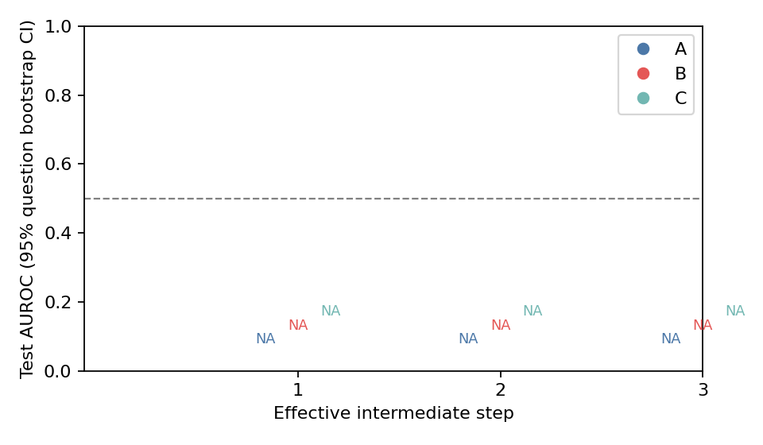

# 第二阶段：逐步 hidden 最终答错风险探针

运行：`20261004-36fe9009f1f5`；报告更新于 2026-10-04T22:39:03.148867+08:00。

标签是完整轨迹最终答错（1）或答对（0）。主指标仅用于完成且可评分轨迹的正常中途步骤；不是局部错误标签。

模型 `Qwen/Qwen2.5-7B-Instruct`，revision `a09a35458c702b33eeacc393d103063234e8bc28`；tokenizer `a09a35458c702b33eeacc393d103063234e8bc28`。
数据 `HuggingFaceH4/MATH-500` / test，revision `6e4ed1a2a79af7d8630a6b768ec859cb5af4d3be`。
按 unique_id 排序后用种子 20261004 洗牌：100 train / 200 test / 10 smoke，剩余 190 不使用；原始字段见 manifest.json。
BF16 / 单卡 / batch 1 / SDPA / greedy；4096 新 token、8192 总 token；C=0.1、max_iter=2000；所有 Transformer 层分别做训练内五折选层。

这是采用逐步训练、题目权重、明确 Step 标记和独立测试的适配实验，不宣称完全复现论文。

特征逐个端点重前向其原始 token 前缀，保持 BF16 / SDPA / use_cache=False。
原单次整段重前向与独立前缀的逐坐标比较在 smoke 中失败；诊断原样保留，不称通过，正式特征不采用该方式。
逐前缀提取另与独立 decoder 的最后位置比较，并检验同长度未来替换及错一 token 的负对照；容差未扩大。

## 实际环境

```json
{
  "bf16_sdpa_forward": true,
  "bf16_supported": true,
  "cuda_available": true,
  "cuda_build": "12.8",
  "executable": "/root/miniconda3/bin/python",
  "free_total_bytes": [
    50353602560,
    50866487296
  ],
  "nvidia_smi": "NVIDIA GeForce RTX 4090, 49140 MiB, 48507 MiB, 595.58.03",
  "platform": "Linux-5.15.0-78-generic-x86_64-with-glibc2.35",
  "python": "3.12.3",
  "versions": {
    "antlr4-python3-runtime": "4.13.2",
    "datasets": "4.8.5",
    "huggingface-hub": "0.36.2",
    "latex2sympy2-extended": "1.11.0",
    "math-verify": "0.9.0",
    "matplotlib": "3.10.5",
    "numpy": "2.3.2",
    "scikit-learn": "1.9.1",
    "torch": "2.8.0+cu128",
    "transformers": "4.57.3"
  }
}
```

## 采集与排除

```json
{
  "train": {
    "generated": 100,
    "completed": 99,
    "correct": 70,
    "wrong": 27,
    "truncated": 1,
    "unscorable": 3,
    "no_steps": 1,
    "format_error_trajectories": 1,
    "features_missing_or_corrupt": 0,
    "planned": 100,
    "PREDICTION_UNPARSEABLE": 1,
    "MISSING_OR_INCOMPLETE_BOXED": 1,
    "LENGTH_TRUNCATED": 1,
    "analyzable_end": 97,
    "analyzable_intermediate": 96
  },
  "test": {
    "generated": 200,
    "completed": 198,
    "correct": 142,
    "wrong": 54,
    "truncated": 2,
    "unscorable": 4,
    "no_steps": 5,
    "format_error_trajectories": 5,
    "features_missing_or_corrupt": 0,
    "planned": 200,
    "LENGTH_TRUNCATED": 2,
    "MISSING_OR_INCOMPLETE_BOXED": 1,
    "FINAL_FORMAT_ERROR": 1,
    "analyzable_end": 196,
    "analyzable_intermediate": 191
  }
}
```

## 自检与备份

- [CPU 自检](../../self_check.json)：34 项通过，绑定正式采集脚本 SHA；[额外实现检查](../../implementation_checks.json)是小型模型/固定 tokenizer 检查，不能当作正式结果。
- [10 道真实 smoke 检查](smoke_checks.json)：逐前缀提取与独立 decoder 末尾向量、同长度未来内容替换的误差均为 0；全部错一 token 负对照检测到差异。6 道正确、3 道错误、1 道缺少完整 boxed；无截断。
- 原单次整段重前向与独立前缀的逐坐标检查**失败**：首次最大绝对误差 1.0、RMS 0.03251。该方式未用于正式特征，容差未扩大。原始[失败检查](single_full_forward_failed_smoke.json)和[提取诊断](extraction_diagnostics.json)完整保留；正式采集之前改用独立原始 token 前缀重前向，并重新冻结代码。
- [实际暂停与恢复检查](resume_check.json)通过：第一道 smoke 的 JSON/NPZ 在独立进程恢复后哈希不变，未重新生成。
- 300 道正式采集完整结束，没有正式采集中断、OOM、探针不收敛或备份失败。每 25 道提交并推送；生成、离线提取和探针评分的实际耗时保存在每题 JSON 与 test_predictions.csv 中。
- 原生 Git LFS 远端取回通过。[首次特征核验](backup.json)及[正式第一批前缀特征独立核验](formal_feature_remote_verification.json)均有记录；正式 NPZ 从全新临时仓库取得，其本地文件、LFS OID、下载文件 SHA-256 均为 `a442596fe6fc8c60d92f528bce464cd7c7dfc0e1d48e56103184bb09121e8efc`。
- [最终科学复核](final_scientific_audit.json)通过：310 道记录的题目/划分/提取来源和有效 NPZ 哈希一致；独立按题等权计算的 AUROC、配对差值与结果一致，3 道测试轨迹的保存参数预测复现误差小于 1.2e-16。
- [交叉验证与标准化复核](cv_scaler_audit.json)通过：97 道训练题组成共同五折，测试/smoke 题不进入训练；B/C 的 scaler、拟合及验证每题总权重为 1。参数冻结时间为 2026-10-04 22:38:43（上海），先于测试评分。

## 独立测试

A 是用完整轨迹末尾训练的探针；B 是用训练题全部有效中途步骤训练的共享探针；C 只使用当前步号和当前生成前缀 token 数。A/B 分别独立选层，两者均选择 hidden_states 索引 19。

选层（A/B 独立选择）：`{'A': 19, 'B': 19, 'C': None}`。
训练覆盖：`{'A': {'questions': 97, 'correct': 70, 'wrong': 27}, 'B': {'questions': 96, 'correct': 69, 'wrong': 27}, 'C': {'questions': 96, 'correct': 69, 'wrong': 27}}`；失败：`{}`。

| 位置 | 题数（正确/错误） | A AUROC [95% CI] | B AUROC [95% CI] | C AUROC [95% CI] |
|---|---|---|---|---|
| step_1 | 191 (137/54) | 0.5649 [0.4790, 0.6532] | 0.6408 [0.5517, 0.7220] | 0.5677 [0.4761, 0.6564] |
| step_2 | 191 (137/54) | 0.6265 [0.5416, 0.7073] | 0.7124 [0.6288, 0.7897] | 0.5476 [0.4509, 0.6366] |
| step_3 | 189 (135/54) | 0.6466 [0.5535, 0.7379] | 0.7403 [0.6561, 0.8224] | 0.5963 [0.5058, 0.6881] |
| intermediate_all | 191 (137/54) | 0.6633 [0.6106, 0.7135] | 0.7339 [0.6657, 0.7954] | 0.5828 [0.5273, 0.6357] |
| full_trajectory_end | 196 (142/54) | 0.8466 [0.7848, 0.8977] | 0.7688 [0.6843, 0.8470] | NA |

C 不用于完整轨迹末尾对照；A/B 末尾单独报告。所有中途比较使用共同有效位置。

每题总权重为 1；bootstrap 按题重抽 1000 次，整题全部步骤随同抽取，单类重复样本跳过。有效次数与 paired AUROC 差及其 CI 见 metrics.json。

```json
{
  "step_1": {
    "A-C": {
      "difference": -0.0028386050283859543,
      "ci95": [
        -0.1306958943184646,
        0.13513037491115845
      ],
      "bootstrap_valid": 1000,
      "bootstrap_skipped": 0
    },
    "B-C": {
      "difference": 0.07312787239794549,
      "ci95": [
        -0.04241209169333465,
        0.18665478967220797
      ],
      "bootstrap_valid": 1000,
      "bootstrap_skipped": 0
    },
    "B-A": {
      "difference": 0.07596647742633145,
      "ci95": [
        -0.01954706016536944,
        0.16930893740522537
      ],
      "bootstrap_valid": 1000,
      "bootstrap_skipped": 0
    }
  },
  "step_2": {
    "A-C": {
      "difference": 0.07894025412273598,
      "ci95": [
        -0.048657631399980604,
        0.2026469700735796
      ],
      "bootstrap_valid": 1000,
      "bootstrap_skipped": 0
    },
    "B-C": {
      "difference": 0.16477426331440936,
      "ci95": [
        0.04943623202362604,
        0.27708011480673694
      ],
      "bootstrap_valid": 1000,
      "bootstrap_skipped": 0
    },
    "B-A": {
      "difference": 0.08583400919167339,
      "ci95": [
        0.015022169887932394,
        0.16032766653188057
      ],
      "bootstrap_valid": 1000,
      "bootstrap_skipped": 0
    }
  },
  "step_3": {
    "A-C": {
      "difference": 0.05034293552812075,
      "ci95": [
        -0.08007848159023567,
        0.17301331968227873
      ],
      "bootstrap_valid": 1000,
      "bootstrap_skipped": 0
    },
    "B-C": {
      "difference": 0.1440329218106997,
      "ci95": [
        0.04079954350161132,
        0.24858243801915786
      ],
      "bootstrap_valid": 1000,
      "bootstrap_skipped": 0
    },
    "B-A": {
      "difference": 0.09368998628257896,
      "ci95": [
        0.014882176467565077,
        0.17435883028668464
      ],
      "bootstrap_valid": 1000,
      "bootstrap_skipped": 0
    }
  },
  "intermediate_all": {
    "A-C": {
      "difference": 0.08051341571556814,
      "ci95": [
        0.013997491783005684,
        0.1468836366480921
      ],
      "bootstrap_valid": 1000,
      "bootstrap_skipped": 0
    },
    "B-C": {
      "difference": 0.15104981948120844,
      "ci95": [
        0.09512196451356028,
        0.20724018347401965
      ],
      "bootstrap_valid": 1000,
      "bootstrap_skipped": 0
    },
    "B-A": {
      "difference": 0.0705364037656403,
      "ci95": [
        0.019473853845975275,
        0.12304833141814721
      ],
      "bootstrap_valid": 1000,
      "bootstrap_skipped": 0
    }
  }
}
```



## 代表性风险轨迹

- [`test/algebra/109.json`](records/test/4d45909b2a8247c82e26.json)，最终标签 0，B 的逐步风险：1:0.000, 2:0.000, 3:0.006, 4:0.001, 5:0.001。
- [`test/counting_and_probability/134.json`](records/test/fa5c5e4e02470df664e2.json)，最终标签 0，B 的逐步风险：1:0.995, 2:0.941, 3:0.099, 4:0.937。
- [`test/number_theory/533.json`](records/test/6afa1fcf6287ea6fd1dc.json)，最终标签 1，B 的逐步风险：1:0.002, 2:0.003, 3:0.001, 4:0.001, 5:0.098, 6:0.093, 7:0.280, 8:0.019。
- [`test/intermediate_algebra/2196.json`](records/test/a0b7a5f303eb3960b616.json)，最终标签 1，B 的逐步风险：1:0.997, 2:0.746, 3:0.970, 4:0.974, 5:0.869, 6:0.433, 7:0.576, 8:0.617, 9:0.696, 10:0.812, 11:0.879。

## 结论

此设置下，B 在全部中途位置提供了超过随机与简单进度基线的最终答错风险信号（两项 bootstrap CI 均支持）。

全部中途位置 B−C = 0.15105，95% CI [0.09512, 0.20724]；B−A = 0.07054，95% CI [0.01947, 0.12305]。第 1 个有效步骤的 B−C CI 为 [-0.04241, 0.18665]，跨零，不能宣称该位置已明确超过进度基线；第 2、3 个位置的 B−C CI 均为正。完整轨迹末尾单独报告，A = 0.84664，B = 0.76878；这些末尾指标不作为中途效果。

这项实验不能识别首个错误步骤、判断当前检查是否值得、证明降低完成时间或推广到其他模型。
离线重前向耗时不代表在线提取成本；生成、重前向与探针评分耗时分别记录。

步骤端点对齐原始 token，跨界 token 向前对齐；包含 boxed 或明确最终答案的步骤排除，最后正常步骤保留 near_end 标记。
hidden_states[1..L] 排除 embedding，Qwen2 的索引 L 含最终 norm；轨迹末尾取 EOS/控制 token 前最后完整内容 token。

评分仅解析单独 Final answer 行的最后完整 boxed；Math-Verify 标准答案包装为 $...$，无字符串 fallback，解析/比较超时单独排除。

## 文件与恢复

配置与环境见 [config.json](../../config.json) / [manifest.json](manifest.json)；运行日志见 [events.jsonl](events.jsonl)；探针参数见 probe_{A,B,C}.npz/json，详细指标见 [metrics.json](metrics.json) 和 [test_predictions.csv](test_predictions.csv)。
分支：[experiment/step-hidden-probe](https://github.com/WanderingAlgebra/VeriServe/tree/experiment/step-hidden-probe)。
生成自动报告时 HEAD：`98e59ac9c3e7e82fe8769e4b4b864824f0c378d1`；远端备份状态与提交以 backup.json 为准。

从仓库根目录执行（替换成可用 Python 环境）：

```bash
python -m stages.stage2.run_probe --config stages/stage2/config.json --self-check
python -m stages.stage2.run_probe --config stages/stage2/config.json --prepare-only --resume
python -m stages.stage2.run_probe --config stages/stage2/config.json --backup-only --resume
python -m stages.stage2.run_probe --config stages/stage2/config.json --smoke --resume
python -m stages.stage2.run_probe --config stages/stage2/config.json --resume
python -m stages.stage2.run_probe --config stages/stage2/config.json --fit-only --resume
```

换机器后，在已有仓库中取回分支和 LFS 特征；`python` 替换成已安装 README 所列依赖的实际 Python：

```bash
git fetch origin experiment/step-hidden-probe
git switch experiment/step-hidden-probe
git pull --ff-only origin experiment/step-hidden-probe
git lfs install --local
git lfs pull origin experiment/step-hidden-probe
python -m stages.stage2.run_probe --config stages/stage2/config.json --resume
# 只用保存特征做 CPU 拟合/评估，无需 GPU 或生成模型
python -m stages.stage2.run_probe --config stages/stage2/config.json --fit-only --resume
```

300 道已经完成，`--resume` 会校验并跳过已有采集；CPU 重评估仍按原训练划分和固定配置执行。此服务器的可用 Python 为 `/root/miniconda3/bin/python`。
